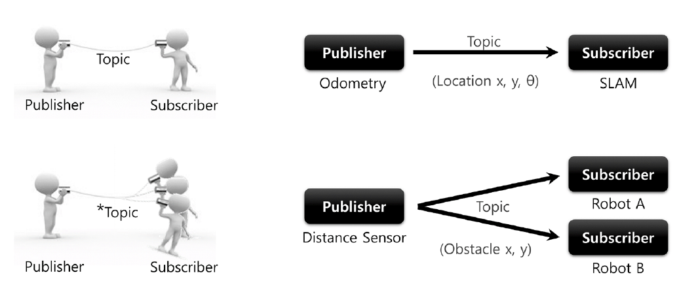
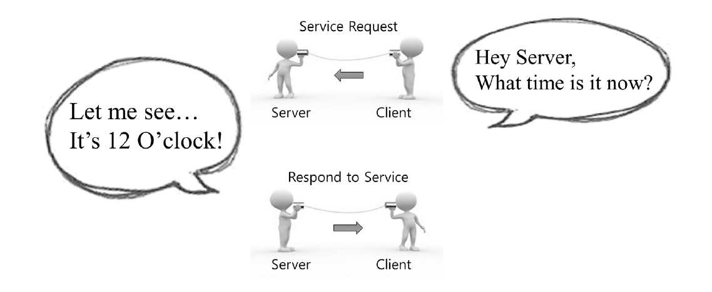
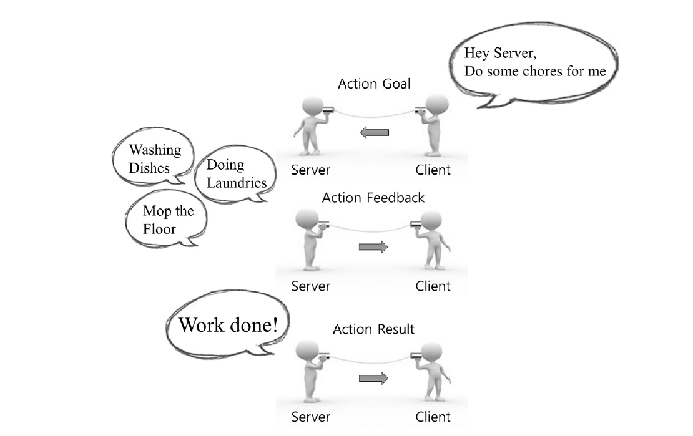
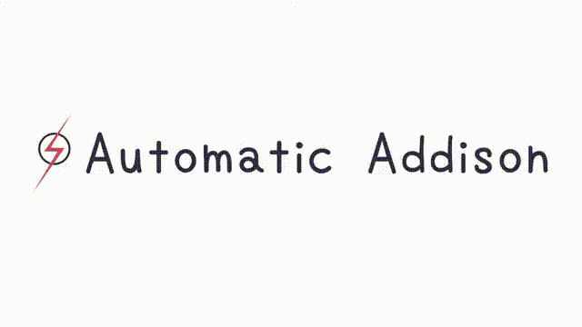

# ROS2 Basics

This document covers the essential building blocks of the Robot Operating System 2 (ROS2) for anyone starting with robotic software development. It includes key components like Nodes, Topics, Messages, Services, Actions, and practical real-world use cases.

------

## Table of Contents

1. [Introduction to ROS2](#Introduction to ROS2)
2. [ROS2 Nodes](#ROS2 Nodes)
3. [Publisher and Subscriber](#Publisher and Subscriber)
4. [Topics and Messages](#Topics and Messages)
5. [Services](#Services)
6. [Actions](#Actions)
7. [ROS2 Commands](#ROS2 Commands)
8. [Real-World Use Cases](#Real World Use Cases)
9. [Conclusion](#Conclusion)

------

## Introduction to ROS2

- ROS2 is a communication middleware designed for distributed robotic systems.
- It uses DDS (Data Distribution Service) under the hood to ensure flexible, real-time, and scalable communication.


------

## ROS2 Nodes

- A **Node** is the fundamental executable in ROS2.
- Each node performs a single responsibility like reading sensor data, running algorithms, or controlling motors.

### Example:

- A `lidar_node` for reading laser scan data.
- A `navigation_node` for planning paths.

------

## Publisher and Subscriber

In ROS 2, **publishers** and **subscribers** are the foundation of **topic-based communication** — a core part of the ROS architecture.

- A **publisher** sends out data on a specific topic.
- A **subscriber** listens to that topic and receives data when it's published.

This communication is **asynchronous**, meaning publishers and subscribers are decoupled and don’t need to know about each other.

------

### 🔁 How it Works

1. The **publisher** advertises a topic with a specific message type.
2. The **subscriber** subscribes to that topic and waits for messages.
3. When the publisher sends a message, all subscribers to that topic receive it.

------

### 🛠️ Real-World Example

Let’s say we have a robot with a camera:

- **Publisher**: A camera node publishes images to `/camera/image_raw` (message type: `sensor_msgs/msg/Image`).
- **Subscriber**: An image processing node subscribes to `/camera/image_raw` to detect objects.

## Topics and Messages

- **Topics** are asynchronous communication channels used for one-to-many or many-to-one communication.
- **Messages** are the data packets exchanged on topics.

### Common Topics:

- `/cmd_vel` — commands for robot velocity.
- `/odom` — robot odometry information.
- `/scan` — LiDAR scan data.

### Example:

```bash
ros2 topic pub /cmd_vel geometry_msgs/msg/Twist "{linear: {x: 1.0}, angular: {z: 0.5}}"
```



------

### 📦 ROS 2 Messages and Message Types

ROS 2 uses strongly typed messages for communication between nodes. Each message is defined using a `.msg` file with predefined field types, which are language-agnostic but map directly to types in Python and C++.

| **ROS 2 Message Type**                | **Example**            | **Python 3 Equivalent**                 | **C++ Equivalent**          | **Usage**                                                    |
| ------------------------------------- | ---------------------- | --------------------------------------- | --------------------------- | ------------------------------------------------------------ |
| `int8`, `int16`, `int32`, `int64`     | `int32 data`           | `int`                                   | `int32_t`                   | For sending signed integers                                  |
| `uint8`, `uint16`, `uint32`, `uint64` | `uint8 led_state`      | `int` (non-negative)                    | `uint8_t`                   | For digital pins, flags, IDs                                 |
| `float32`, `float64`                  | `float64 temperature`  | `float`                                 | `float`, `double`           | For continuous or decimal values (e.g., velocity, temperature) |
| `string`                              | `string robot_name`    | `str`                                   | `std::string`               | For names, labels, messages                                  |
| `bool`                                | `bool is_active`       | `bool`                                  | `bool`                      | For binary flags or toggle states                            |
| `char`, `byte`                        | `char key`, `byte val` | `str` (length 1), `int`                 | `char`, `uint8_t`           | For individual characters or raw bytes                       |
| `time`, `duration`                    | `time stamp`           | `builtin_interfaces.msg.Time`           | `rclcpp::Time`              | Timestamps for synchronization, delay calculations           |
| `geometry_msgs/msg/Point`             | `Point position`       | `x, y, z` floats in object              | `geometry_msgs::msg::Point` | 3D positions in space                                        |
| `std_msgs/msg/Header`                 | `Header header`        | object with `stamp`, `frame_id`         | Same in C++                 | Timestamp and reference frame info for time-sensitive data   |
| `geometry_msgs/msg/Twist`             | `Twist cmd_vel`        | object with `linear`, `angular` vectors | Same                        | Common for mobile robot velocity control                     |
| `sensor_msgs/msg/Image`               | `Image img_data`       | OpenCV/numpy bridge                     | OpenCV or raw array         | For camera input, vision-based processing                    |
| `nav_msgs/msg/Odometry`               | `Odometry odom`        | complex structure                       | Same                        | For tracking robot position, orientation and velocity in space |

### 📘 Notes:

- ROS messages are defined in `.msg` files and compiled into Python and C++ classes.
- Each message type supports **serialization** and **transport** across ROS middleware (DDS).
- Use [ros2 interface show `<package>/msg/<Message>`] to explore message structure.


## Services

- **Services** provide synchronous communication — a request is sent and a response is received.
- Ideal for operations that are infrequent and require feedback.

### Use Case:

- Starting or stopping a camera feed.
- Sending a target position for a manipulator.

### Example:

```bash
ros2 service call /start_motor std_srvs/srv/SetBool "{data: true}"
```



------

## Actions

- **Actions** allow long-running, goal-oriented operations that can be cancelled or monitored.
- Ideal for operations like navigation, manipulation, or trajectory execution.

### Use Case:

- Sending a goal location to a mobile robot.
- Grasping an object with a robotic arm.

### Example:

```bash
ros2 action send_goal /navigate_to_pose nav2_msgs/action/NavigateToPose "{pose: { ... }}"
```



------

## ROS2 Commands

### 🧭 Setup and Environment

```bash
source /opt/ros/<ros2_distro>/setup.bash
source install/setup.bash         # If using a workspace
```

### 📦 Creating a Workspace

```bash
mkdir -p ~/ros2_ws/src
cd ~/ros2_ws
colcon build
source install/setup.bash
```

### 🛠️ Creating a Package

```bash
cd ~/ros2_ws/src
ros2 pkg create --build-type ament_python my_package
ros2 pkg create --build-type ament_cmake my_cpp_package
```

### 🧩 Package Management

```bash
ros2 pkg list                         # List all packages
ros2 pkg prefix <package_name>       # Show install path of package
ros2 pkg executables <package_name>  # List all executables
ros2 run <package_name> <executable> # Run a node
```

### 📡 Nodes

```bash
ros2 node list
ros2 node info <node_name>
ros2 run <package> <node>
```

### 💬 Topics

```bash
ros2 topic list
ros2 topic echo <topic_name>
ros2 topic pub <topic_name> <msg_type> "{data: value}"
ros2 topic info <topic_name>
```

**Examples:**

```
ros2 topic pub /cmd_vel geometry_msgs/Twist "{linear: {x: 1.0}, angular: {z: 0.5}}"
ros2 topic echo /odom
```

### 🛎️ Services

```
ros2 service list
ros2 service type <service_name>
ros2 service call <service_name> <srv_type> "{request_field: value}"
```

**Example:**

```
ros2 service call /reset std_srvs/srv/Empty "{}"
```

### 🎯 Actions

```
ros2 action list
ros2 action send_goal <action_name> <action_type> "{goal_field: value}"
ros2 action status <action_name>
ros2 action feedback <action_name>
```

**Example:**

```
ros2 action send_goal /navigate_to_pose nav2_msgs/action/NavigateToPose "{pose: {...}}"
```

### 🧪 Building and Testing

```
colcon build
colcon test
colcon test-result --all
```

### 🧰 Introspection and Debugging

```
ros2 doctor                     # Diagnose your setup
ros2 interface show <msg_type> # View message or service structure
ros2 msg show geometry_msgs/msg/Twist
ros2 srv show std_srvs/srv/Empty
```

### 🔁 Launching

```
ros2 launch <package_name> <launch_file.py>
```

## 🧠 Advanced ROS 2 Ecosystem

This section introduces powerful tools and frameworks that extend the ROS 2 ecosystem beyond basic topics, services, and actions. These tools are essential for building real-world robotic systems and applications.

------

### 🔍 Visualization Tools

ROS 2 supports several visualization tools to help developers and researchers debug and understand robotic systems in real-time:

- **RViz2**
   A 3D visualization tool to view sensor data, robot state, transformations, and trajectories.
  - ✅ Used for debugging navigation paths, robot pose, camera feeds.
  - 💡 Can display markers, laser scans, occupancy grids, and tf trees.
- **rqt**
   A Qt-based framework that includes tools for plotting, graphing, introspection, and parameter tuning.
  - Modules like `rqt_graph` show the computation graph.
  - `rqt_plot` helps visualize topic data over time.

*Image Placeholder: Diagram of RViz2 and rqt usage.*

------

### 🔄 Transforms (TF2)

Transformations are critical in robotics for tracking the positions and orientations of different robot frames.

- **tf2** in ROS 2 handles coordinate transformations between different parts of a robot.
  - Used to track the position of a camera with respect to the robot base.
  - Publishes a transformation tree (`tf2_frames`) that can be visualized in RViz2.

*Example use case: Base link → camera_link → end_effector_link.*

*Image Placeholder: TF tree visualization.*

------

### 🤖 MoveIt 2 – Motion Planning

**MoveIt 2** is a powerful framework for motion planning, collision checking, and kinematics:

- Used with robotic arms for:
  - Pick and place tasks
  - Inverse kinematics
  - Trajectory execution
- Integrates with RViz2 for interactive planning.

*Key Features:*

- Planning pipelines with OMPL, STOMP, CHOMP.
- Integration with ROS 2 control for actuation.
- Scene representation for collision-aware planning.

*Image Placeholder: Robot arm executing motion plan in MoveIt2 via RViz2.*

------

### 🛠️ ROS 2 Control

ROS 2 Control is a standard interface for controlling hardware and actuators.

- Works with hardware interfaces like:
  - Joint position, velocity, effort controllers.
- Integrates with MoveIt 2 and Gazebo for simulation + control.

*Key Concepts:*

- `controller_manager` to load, start, stop controllers.
- Realtime safe execution loops.
- Works in simulation and real hardware.

*Image Placeholder: Diagram showing robot joints and control interfaces.*

------

### 🧭 Navigation Stack (Nav2)

The ROS 2 Navigation Stack (Nav2) enables autonomous mobile robot navigation.

- **Key Features:**
  - Global and local planners
  - Costmaps and obstacle avoidance
  - Localization (AMCL, SLAM)
  - Behavior trees for modular decision making
- Fully configurable and used in mobile robots like TurtleBot.

*Use Case: Autonomous indoor navigation with LiDAR and map.*

*Image Placeholder: Path planning in RViz2 using Nav2.*

------

###  🧪 Simulation Tools

Simulation allows testing algorithms without physical robots.

- **Gazebo / Ignition Gazebo**:
  - Physics-based 3D simulator with ROS 2 integration.
  - Simulates sensors, dynamics, and environments.
- **Webots, Isaac Sim, Unity3D**:
  - Also support ROS 2 plugins for advanced graphics or real-time control.

*Image Placeholder: Simulated robot in Gazebo navigating environment.*

------

### 🗺️ SLAM and Localization

- SLAM: Builds a map while localizing (e.g., `slam_toolbox`).
- Localization: Determines the robot’s position on a map (`amcl`).

*Used for autonomous exploration and map-based navigation.*

## Real-World Use Cases

### Mobile Robots

- **Topics**: `/odom`, `/scan`, `/cmd_vel`
- **Actions**: `/navigate_to_pose`
- **Services**: `/clear_costmap`

### Manipulators

- **Topics**: Joint states, end-effector velocity
- **Actions**: `/move_group` for MoveIt
- **Services**: Tool change or homing routines

### Drones

- **Topics**: IMU, GPS
- **Actions**: `/takeoff`, `/land`
- **Services**: Arming or disarming the drone

**[Insert image showing a real robot with arrows pointing to topic, service, and action interactions]**

------

## Conclusion

Understanding ROS2 basics is critical to building robust and scalable robotic systems. Mastering nodes, topics, services, and actions enables developers to orchestrate complex robot behavior in real-world environments.

